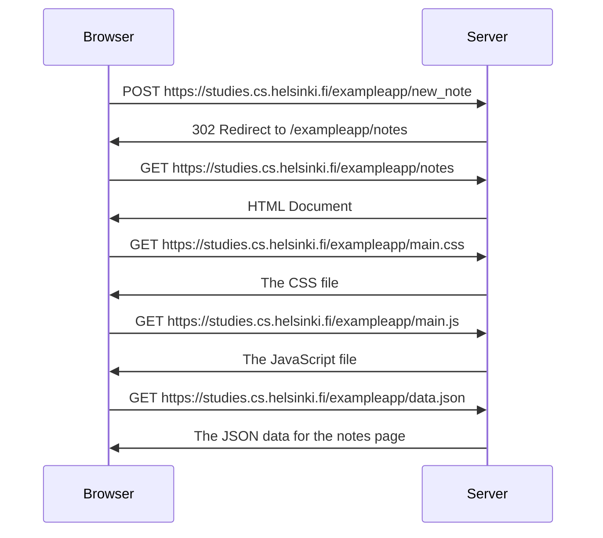

```mermaid
sequenceDiagram
    participant B as Browser
    participant S as Server
    B->>S: POST https://studies.cs.helsinki.fi/exampleapp/new_note
    S->>B: 302 Redirect to /exampleapp/notes
    B->>S: GET https://studies.cs.helsinki.fi/exampleapp/notes
    S->>B: HTML Document
    B->>S: GET https://studies.cs.helsinki.fi/exampleapp/main.css
    S->>B: The CSS file
    B->>S: GET https://studies.cs.helsinki.fi/exampleapp/main.js
    S->>B: The JavaScript file
    B->>S: GET https://studies.cs.helsinki.fi/exampleapp/data.json
    S->>B: The JSON data for the notes page
```